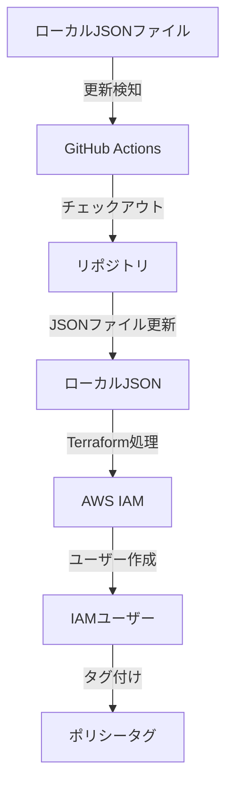
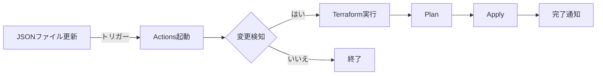
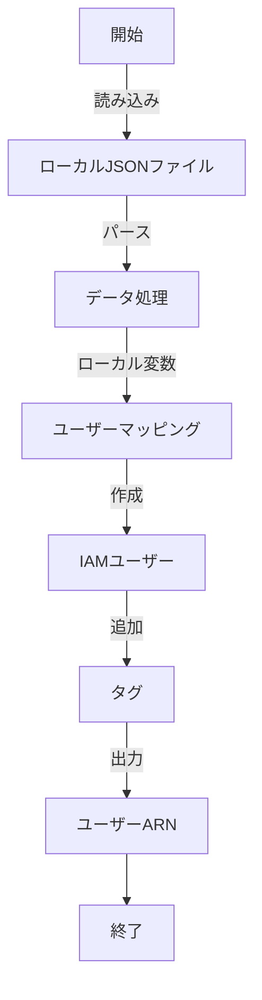
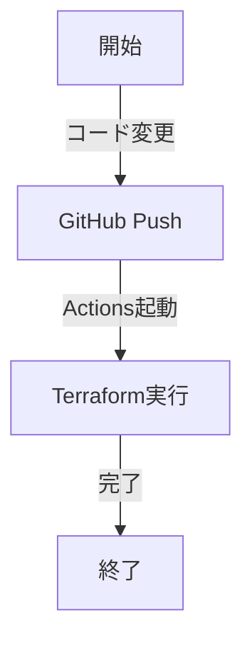

# Terraform IAM Users Management

このリポジトリは、JSON ファイルを元に AWS IAM ユーザーを Terraform を使って自動的に作成するためのコードを提供します。

## システム構成図



## 機能概要
- ローカルJSONファイルからIAMユーザーの一括作成
- GitHubActionsによる自動デプロイ
- S3バックエンドによる状態管理
- タグベースのポリシー管理

## ディレクトリ構造
```
├─ .github/workflows/terraform.yml # GitHub Actions設定
├─ data.tf # データソース定義
├─ main.tf # リソース定義
├─ variables.tf # 変数定義
├─ output.tf # 出力定義
├─ backend.tf # バックエンド設定
└─ iamusers.json # ユーザー設定ファイル
```
## JSONファイルフォーマット
```json
[
    {
        "user_name": "user-1",
        "policy": "policy-1"
    }
]
```

## 前提条件
- Terraform 1.6.6以上
- AWS認証情報
- S3バケット（tfstate用）

## セットアップ手順
1. リポジトリのクローン
```bash
git clone <repository-url>
```

2. AWS認証情報の設定
```bash
export AWS_ACCESS_KEY_ID="your-access-key"
export AWS_SECRET_ACCESS_KEY="your-secret-key"
```

3. Terraformの初期化
```bash
terraform init
```

4. 実行計画の確認
```bash
terraform plan
```

5. インフラの適用
```bash
terraform apply
```

## GitHub Actions自動化フロー



## 設定項目
- リージョン: ap-northeast-1（東京）
- バックエンドS3バケット: onewonder-tfstate
- tfstateパス: terraform-iamusers-from-json/terraform.tfstate

## セキュリティ対策
- prevent_destroy設定によるユーザーの誤削除防止
- S3バックエンドの暗号化有効化
- GitHub Secretsによる認証情報管理

## 注意事項
- ユーザーの削除は手動操作が必要
- JSONファイルの形式を厳守すること
- バックエンドS3バケットのアクセス権限を確認

## トラブルシューティング
1. terraform init失敗時
   - S3バケットのアクセス権限を確認
   - リージョン設定を確認

2. ユーザー作成失敗時
   - JSONファイルのフォーマットを確認
   - IAM権限を確認

## データフロー図



## 運用ガイド

### セットアップ手順
1. 環境準備
   ```bash
   # AWS認証情報の設定
   export AWS_ACCESS_KEY_ID="your-access-key"
   export AWS_SECRET_ACCESS_KEY="your-secret-key"
   ```

2. 初期化と実行
   ```bash
   terraform init
   terraform plan
   terraform apply
   ```

### 自動化フロー


## 設定リファレンス

### AWS設定
- リージョン: ap-northeast-1（東京）
- バケット: onewonder-tfstate
- 状態ファイル: terraform-iamusers-from-json/terraform.tfstate

### セキュリティ設定
- prevent_destroy有効
- S3暗号化有効
- GitHub Secrets利用

## トラブルシューティング

### よくある問題
1. 初期化エラー
   - バケットアクセス確認
   - リージョン設定確認

2. 作成エラー
   - JSON形式確認
   - IAM権限確認

### 注意事項
- ユーザー削除は手動実施
- JSON形式を厳守
- バケット権限を確認
